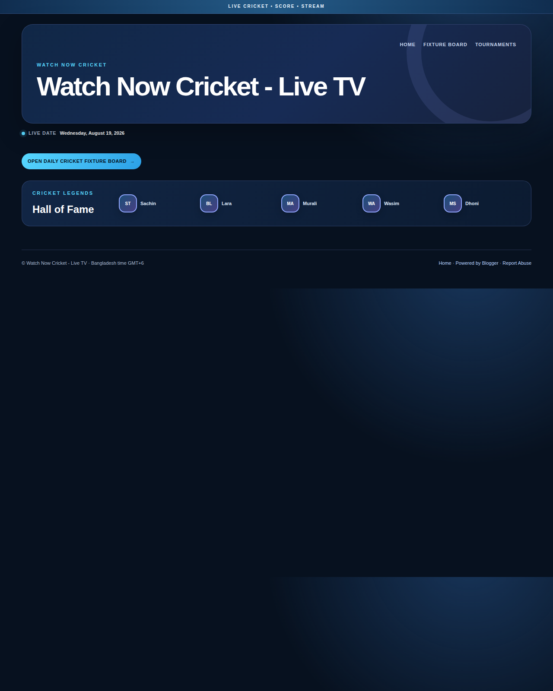
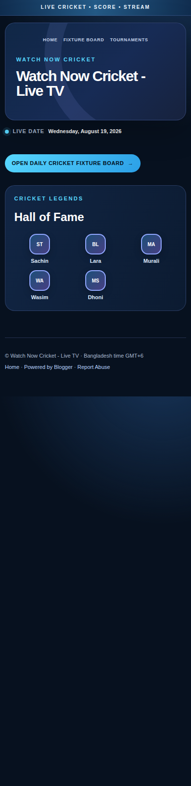

# How We Built an Automated Cricket Fixtures Website with Blogger, Vercel, and Supabase

**Published:** 19 August 2026  
**Project:** Watch Now Cricket  
**Target reader:** A site owner who wants to publish daily cricket fixtures without updating tables by hand

> We built a working cricket fixture system that collects match data, converts times to Bangladesh time, checks source evidence, and publishes approved fixtures to Blogger.

## The problem

A cricket schedule changes every day. Manual updates take time. They also create simple errors. A match can use the wrong date, the wrong time zone, or the wrong team name.

The site needed a better process. It needed to collect fixtures, group them by tournament, publish match posts, and update one daily fixture board.

The site also needed to keep uncertain data away from visitors. A public schedule may show a match without a clear time zone. Another source may use a different team name. These records need review before publication.

## The result

The final system uses four main parts.

| Part | Role |
|---|---|
| Blogger | Displays the public cricket theme, match posts, and fixture board. |
| CricketData | Provides the primary match feed. |
| Supabase | Stores fixtures, source evidence, verification state, and publisher runs. |
| Vercel | Runs the API, dashboard, and scheduled publisher endpoint. |

The system uses a verified-only rule. A fixture can be `verified`, `candidate`, or `conflict`.

| State | Meaning | Published automatically? |
|---|---|---:|
| Verified | The match has enough matching source evidence. | Yes |
| Candidate | A source found the match, but the evidence is incomplete. | No |
| Conflict | Sources disagree about the teams, time, date, or identity. | No |

This rule is important. It prevents uncertain fixtures from entering the public table.

## Building the Blogger theme

We first replaced the inherited Blogger theme with a clean XML theme. The new theme removed old attribution links, unknown assets, and unnecessary external code.

The design uses a midnight-blue background with cyan highlights. The layout includes a large hero area, a live date, a Fixture Board link, a Hall of Fame section, and a responsive content area.

The theme also supports Blogger post data. This matters because the home page and direct post pages use Blogger’s widget contracts. A custom layout must preserve those contracts.



*Figure 1. The live desktop homepage. It shows the midnight-blue hero, live date, Fixture Board button, Hall of Fame section, navigation, and footer.*

The theme uses a same-origin feed fallback for the fixture table. The fallback reads published Blogger data, sanitizes the output, and renders the approved board content. This keeps the public table linked to the published match posts.

## Making the table responsive

A fixture table can be difficult to read on a small screen. We used a mobile layout that keeps the important fields visible. Long team names can wrap. Buttons remain large enough to tap. The table does not force the full page to become wider than the screen.



*Figure 2. The live mobile homepage at 390 pixels wide. The hero title wraps. The Hall of Fame cards use multiple rows. The main button and footer links remain readable.*

The mobile test also checked horizontal overflow, link visibility, contrast, and table behavior. The result was recorded in the project QA notes.

## Collecting more than the first API page

The first provider request returned only a limited set of records. This caused missing events. The collector now uses bounded offset pagination. It requests more than one page and stops when the provider returns no new records or the safety limit is reached.

The collector then converts every match time to the Bangladesh calendar date. It stores business timestamps in UTC. It formats public times as GMT+6.

The collector also records coverage information. A run can show how many pages it inspected and how many fixtures it received. This makes a partial provider response easier to detect.

## Adding a second source

CricketData remains the primary source. We added TheSportsDB as a structured discovery source. Secondary-only events do not publish by default.

The system compares team names and start times. A close match can become verified. A source-only event becomes a candidate. A disagreement becomes a conflict.

For important promotions, we used permitted structured or official schedule evidence. For example, nine candidates were corroborated during the review process. Seven were TNPL fixtures. Two were Duleep Trophy fixtures.

The nine promoted fixtures were stored with source evidence. Fourteen candidates remained blocked because their time, identity, or participant information was not safe to publish.

## Adding the publish gate

The publisher performs the same safety check before it creates or updates Blogger posts. Only verified records can enter the publishable set.

Candidate and conflict records remain in Supabase. The dashboard shows them for review. This is safer than hiding them or guessing their values.

We also fixed a serious persistence bug. A later provider refresh could overwrite a manually verified record with a new candidate record. The fix now preserves verified status and merges source evidence during every upsert.

Regression tests cover three cases. A verified record stays verified. New source evidence is merged. A genuine verified record can replace a candidate record.

## Connecting Vercel Cron

The scheduled endpoint is:

```text
/api/cron/publish-cricket
```

The schedule is:

```text
5 18 * * *
```

This runs at 18:05 UTC, which is 00:05 in Bangladesh. The route requires a `CRON_SECRET` bearer token.

The first manual test returned 401 because the secret was not present in the Vercel Production environment. We added the secret and redeployed. The next authenticated test reached the route and returned HTTP 200.

The run persisted its result in Supabase. It fetched 28 fixtures, inspected 12 CricketData pages, and updated five Blogger posts. Later, the verification workflow increased the stored verified set to 15 records while keeping 14 candidates out of publication.

The provider and Blogger APIs can also return partial or quota errors. The run log stores these results. This makes the failure visible instead of treating every request as successful.

## What the project taught us

The main lesson is simple: data collection and data publishing are different jobs.

A provider can return a match. That does not mean the match is ready for public display. The system needs a date rule, a time-zone rule, an identity rule, and a source rule.

The second lesson is to protect manual decisions. If a person verifies a match, a later refresh must not remove that decision without clear evidence.

The third lesson is to test the complete path. Unit tests are useful, but they do not replace a production trigger test. We tested the bearer token, the Vercel route, the Supabase run record, the Blogger response, and the public board.

## A practical build plan

If you want to build a similar system, start with a small scope. Collect one day of fixtures. Normalize the times. Store the records. Then add the publish gate.

Next, add a second source for corroboration. Do not publish source-only events until you define a clear rule for them. Add a review queue for uncertain records.

Finally, add the scheduled job. Test it with a controlled manual request. Check the production run record after every change.

## Final architecture

The complete flow is:

```text
CricketData + secondary source
              |
              v
       Normalize to UTC/GMT+6
              |
              v
       Match and source checks
              |
      +-------+--------+
      |                |
   Verified       Candidate/Conflict
      |                |
      v                v
 Blogger posts     Dashboard review
      |
      v
 Daily Fixture Board
```

This design keeps the public site useful while reducing the risk of incorrect fixtures.

## References and project evidence

The live site is [Watch Now Cricket](https://watchnowcricket.blogspot.com/). The publisher dashboard is hosted through [Vercel](https://cricket-daily-publisher.vercel.app). The official technical references used during the implementation include [Vercel Cron Jobs](https://vercel.com/docs/cron-jobs), [CricketData documentation](https://cricketdata.org/how-to-use-cricket-data-api.aspx), [TheSportsDB API guide](https://www.thesportsdb.com/docs_api_guide), [BCCI Duleep Trophy information](https://www.bcci.tv/news/article/duleep-trophy-2026-27-all-six-squads-revealed), and the [Cricbuzz TNPL schedule](https://www.cricbuzz.com/cricket-series/12620/tamil-nadu-premier-league-2026/matches).

The implementation evidence is recorded in the project’s cron verification audit, candidate corroboration audit, and mobile QA notes. Search-volume and keyword-difficulty values were not available from a paid SEO platform. Keyword priorities are therefore directional.
